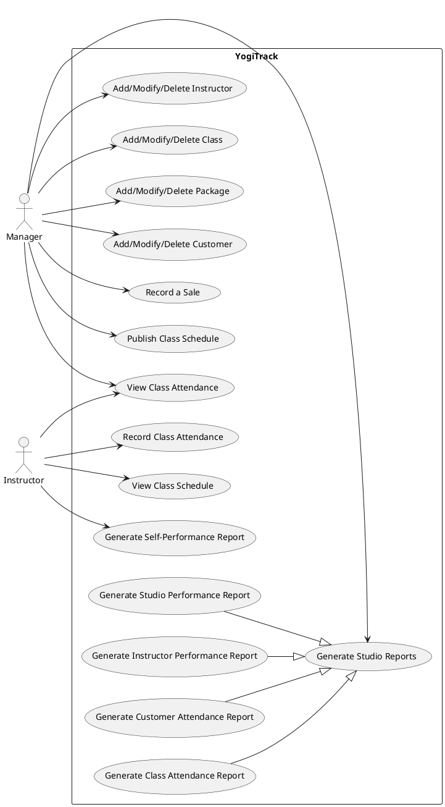

# Fig. 5 — Use-case diagram (course document)

Image: `fig5-use-case-diagram.png` (same folder). Text transcription below so it
can be read without opening the image.

## System boundary: YogiTrack

### Actor: Manager
- Generate Studio Reports
- Add/Modify/Delete Instructor
- Add/Modify/Delete Class
- Add/Modify/Delete Package
- Add/Modify/Delete Customer
- Record a Sale
- Publish Class Schedule
- View Class Attendance

### Actor: Instructor
- View Class Attendance (shared with Manager)
- Record Class Attendance
- View Class Schedule
- Generate Self-Performance Report

### Generalization
Four use cases specialize "Generate Studio Reports" (hollow-triangle arrows
pointing at the parent):
- Generate Studio Performance Report
- Generate Instructor Performance Report
- Generate Customer Attendance Report
- Generate Class Attendance Report

## PlantUML source (reconstruction)
The original looks like PlantUML output. This source reproduces it and can be
edited for the project report (render at plantuml.com or with the VSCode
PlantUML extension).

## Where the diagram and the written use cases disagree
The diagram is broader than the written specs in `04-use-cases.md`. These gaps
are tracked as decisions in `07-design-decisions.md`.

1. **Add vs Add/Modify/Delete.** The diagram shows full add/modify/delete for
   instructor, class, package, and customer. The written specs describe only
   "Add".
2. **Publish Class Schedule** is its own use case in the diagram. In the written
   specs it is only step 5 of UC2 (Add a class).
3. **View Class Attendance** (Manager and Instructor) and **View Class Schedule**
   (Instructor) appear in the diagram with no written spec.
4. **Reports don't match.** Diagram: Studio Performance, Instructor Performance,
   Customer Attendance, Class Attendance, plus an instructor Self-Performance
   report. Written UC7: package sales, instructor list with classes and
   check-ins, customer list with packages (active/future/expired), monthly
   teacher payment.
5. **Two actors** implies the app presents different capabilities to a Manager
   and an Instructor. Neither document says how users are identified (login or
   otherwise).
