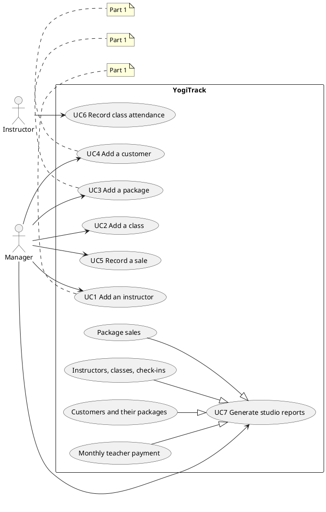
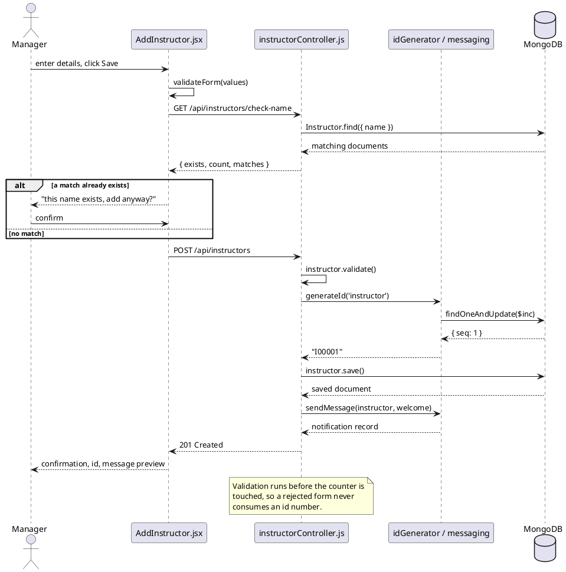
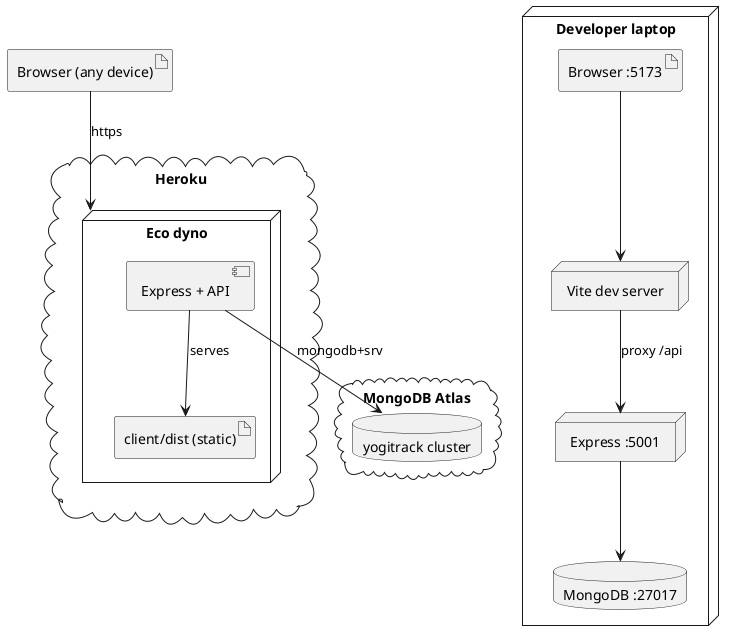

# UML models

Four models describe YogiTrack. Each is an SVG in `diagrams/`, drawn by hand so
the layout stays readable and the notes can carry the reasoning. PlantUML
source is included underneath each one so the diagrams can be regenerated or
edited later (render at plantuml.com or with the VSCode PlantUML extension).

| Model | File | Answers |
|---|---|---|
| Use-case diagram | `diagrams/use-case-diagram.svg` | Who uses the system, and what can they do? |
| Class diagram | `diagrams/class-diagram.svg` | What data does it hold, and how is it related? |
| Sequence diagram | `diagrams/sequence-uc1-add-instructor.svg` | What happens, in order, when a use case runs? |
| Architecture & deployment | `diagrams/architecture.svg` | What are the parts, and where do they run? |

---

## 1. Use-case diagram


Two actors. The **Manager** does everything to do with records and money; the
**Instructor** records attendance for their own classes. The four report
variants are drawn as specialisations of UC7 "Generate studio reports",
matching the structure of the course's own Fig. 5.

Shaded ellipses are delivered in Part 1; dashed ones are Part 2.

This diagram covers the **written** specification in `04-use-cases.md`. The
course's Fig. 5 is broader — it shows Add/Modify/Delete, two view-only use
cases and a different set of report names. That gap is deliberate, catalogued
in `08-use-case-diagram.md` and tracked as open decisions 10–12.

### PlantUML source



---

## 2. Class diagram


Seven collections: six domain entities plus `counters`, which is infrastructure
rather than domain data but is shown because it is a real collection that the
ID generator depends on.

Three things worth pointing out to anyone reading this from a Java background:

- **A Mongoose schema is the class definition; a document is an instance.**
  The model object that `mongoose.model()` returns is what you call the static
  methods on (`Instructor.find()`), much like a Java class object.
- **`«FK»` is a convention, not a constraint.** MongoDB will happily store a
  `customerId` that matches no customer. There is no foreign-key enforcement
  and no `JOIN`. Wherever a reference matters, the Express controller has to
  check that the target exists — the database will not do it.
- **`/ fullName` is a derived attribute** (UML notation for a computed value).
  In Mongoose it is a *virtual*: a getter with no stored field behind it.

### PlantUML source

```plantuml
@startuml
hide circle
skinparam classAttributeIconSize 0

class Instructor {
  - instructorId : String {unique}
  - firstName : String
  - lastName : String
  - address : String
  - phone : String
  - email : String
  - preferredContact : ContactMode
  - active : Boolean
  + /fullName : String
}

class Customer {
  - customerId : String {unique}
  - firstName : String
  - lastName : String
  - address : String
  - phone : String
  - email : String
  - preferredContact : ContactMode
  - classBalance : Number
  + /fullName : String
}

class Package {
  - packageId : String {unique}
  - name : String
  - category : PackageCategory
  - numClasses : Number
  - unlimited : Boolean
  - classType : ClassType
  - startDate : Date
  - endDate : Date
  - price : Number
}

class Class {
  - classId : String {unique}
  - instructorId : String
  - day : String
  - time : String
  - durationMinutes : Number
  - classType : ClassType
  - payRate : Number
}

class Sale {
  - saleId : String {unique}
  - customerId : String
  - packageId : String
  - amountPaid : Number
  - paymentMode : String
  - paidAt : Date
  - validFrom : Date
  - validTo : Date
}

class Attendance {
  - classId : String
  - instructorId : String
  - heldAt : Date
  - customerIds : String[]
}

class Counter {
  - _id : String
  - seq : Number
}

enum ContactMode { phone
email }
enum ClassType { General
Special }
enum PackageCategory { General
Senior }

Instructor "1" --> "0..*" Class : teaches
Customer   "1" --> "0..*" Sale : buys
Package    "1" --> "0..*" Sale : sold as
Class      "1" --> "0..*" Attendance : held as
Instructor "1" --> "0..*" Attendance : records
Customer   "1" --> "0..*" Attendance : attends

note right of Counter
  Supplies every I/C/P/L/S id
  by atomic $inc. Infrastructure,
  not a domain entity.
end note
@enduml
```

---

## 3. Sequence diagram — UC1, Add an instructor


UC1 was chosen for the sequence diagram because it is the only Part 1 use case
with a branch in it: the duplicate-name confirmation. The numbered green labels
tie each message back to a step in the written use case, so the diagram can be
read side by side with `04-use-cases.md`.

Two details the diagram is specifically there to make visible:

- **The `alt` fragment** is the two-step duplicate interaction (design decision
  2). The form asks the server whether the name exists *before* it tries to
  save. Only a match produces a prompt. Two instructors genuinely may share a
  name, so this is a question, not a rejection.
- **Validation (message 10) happens before ID generation (message 11).** This
  ordering is not cosmetic; see the note on the diagram and design decision 15.

### PlantUML source



---

## 4. Architecture and deployment


Three views in one figure:

1. **Component view** — the path a single request takes through the folders of
   the repository. Every use case follows this same path, which is the point of
   organising the server into `routes / controllers / services / models`
   instead of putting the logic in one file.
2. **Deployment view** — development versus production. The interesting part is
   what *changes*: in development two processes run on two ports and Vite
   proxies `/api` to Express; in production one Heroku process serves both the
   compiled React build and the API. Because the frontend only ever uses
   relative URLs, no application code differs between the two.
3. **Delivery pipeline** — commit, push, build and test, then release.

### PlantUML source (deployment view)


