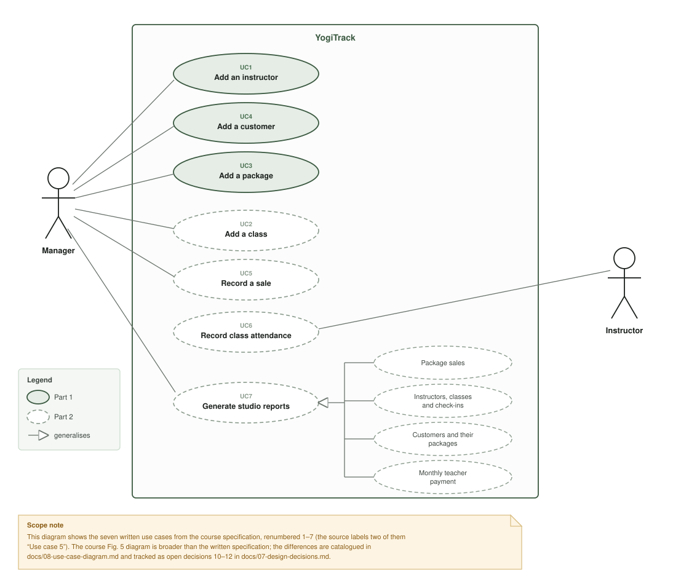
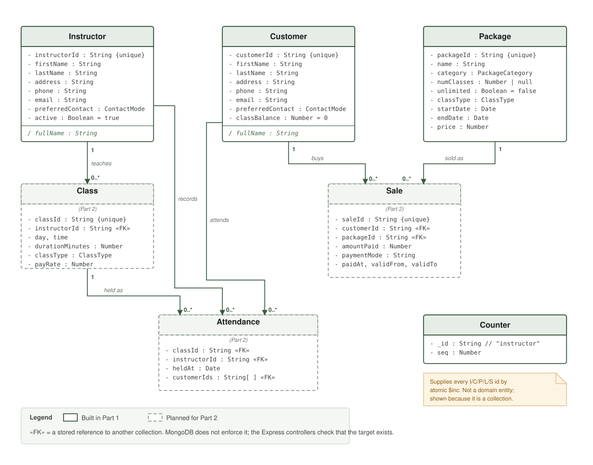
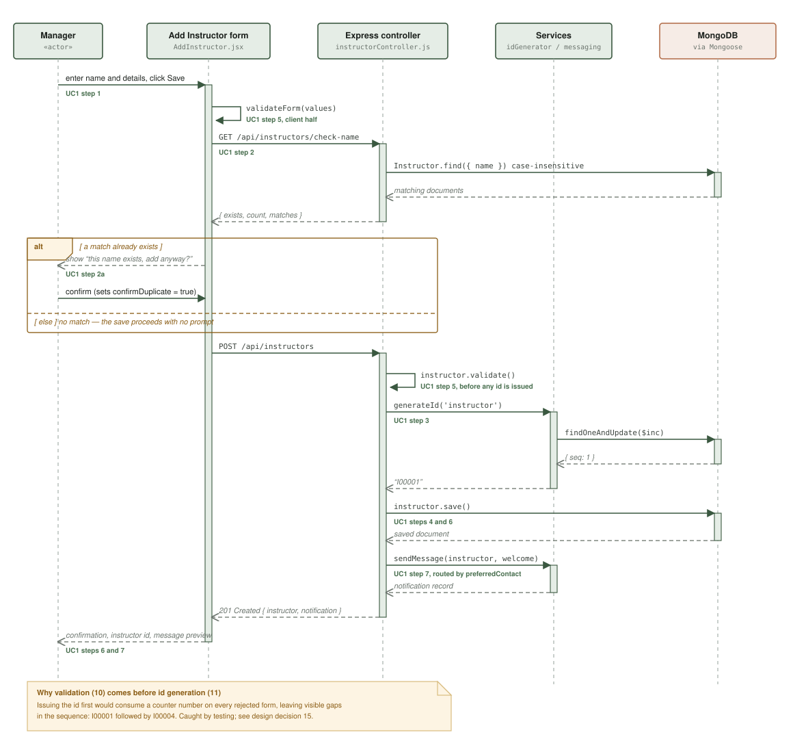
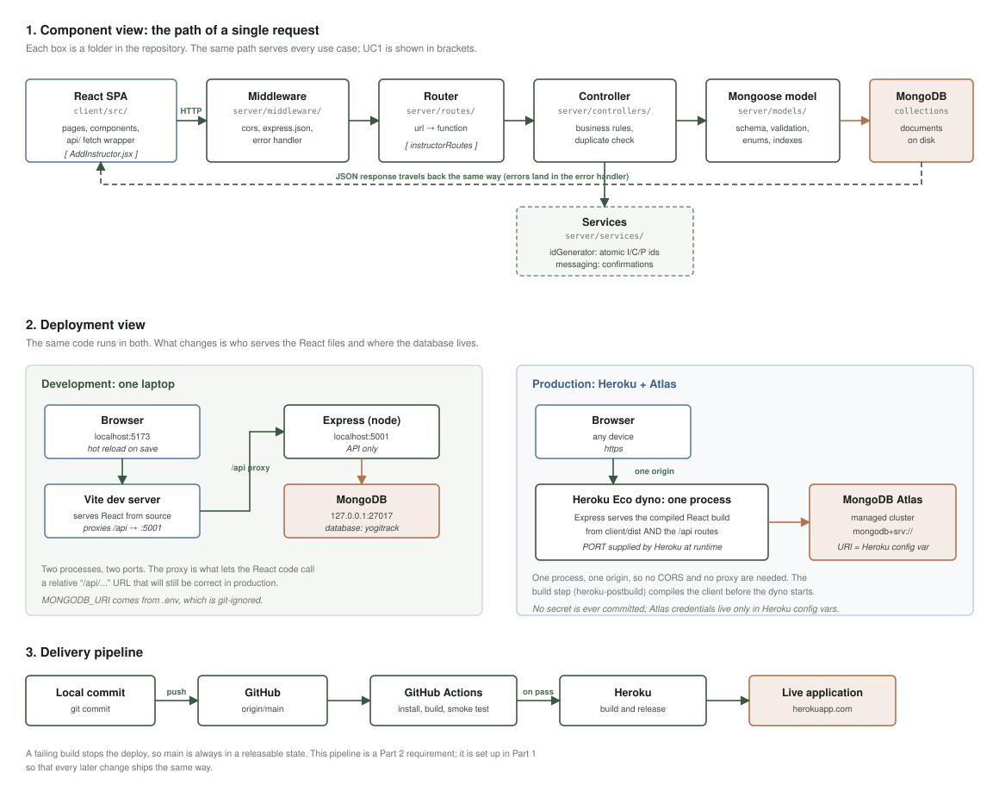

# YogiTrack — Project Report, Part 1

**Course:** ACS 5423 — Software Development for World Wide Web
**Institution:** University of Oklahoma
**Application:** YogiTrack, a record-keeping system for the Yoga H'om studio
**Increment:** Application 1.0 (Part 1)
**Technology stack:** MongoDB · Express · React · Node.js (MERN)
**Live application:** https://yogitrack-zb-9cc3ff17df1c.herokuapp.com
**Repository:** https://github.com/ZB56/yogitrack

---

## Contents

1. [Executive summary](#1-executive-summary)
2. [Problem statement and background](#2-problem-statement-and-background)
3. [Scope of Part 1](#3-scope-of-part-1)
4. [Use cases](#4-use-cases)
5. [UML models](#5-uml-models)
6. [Key design decisions](#6-key-design-decisions)
7. [Technology stack and how it is used](#7-technology-stack-and-how-it-is-used)
8. [Code organisation](#8-code-organisation)
9. [User interface design](#9-user-interface-design)
10. [Testing and verification](#10-testing-and-verification)
11. [Deployment](#11-deployment)
12. [Known limitations and the Part 2 plan](#12-known-limitations-and-the-part-2-plan)
13. [Appendix A — API reference](#appendix-a--api-reference)
14. [Appendix B — running the project](#appendix-b--running-the-project)

---

## 1. Executive summary

Yoga H'om runs its studio on paper: a card per customer for classes bought and
attended, and a signed sheet per class. That process does not scale and cannot
answer questions like "how much do we owe each instructor this month?" without
manual tallying.

YogiTrack replaces those records with a web application. Part 1 delivers the
foundation of the data model — the people and products the rest of the system
refers to — together with the full technical architecture that Part 2 builds on.

**What Part 1 delivers:**

| # | Use case | Status |
|---|---|---|
| UC1 | Add an instructor | **Implemented end to end** |
| UC4 | Add a customer | **Implemented end to end** |
| UC3 | Add a package | **Implemented end to end** |

> **Status note.** This report describes only what is in the committed code.
> All three use cases planned for this increment are complete; the grading
> criteria require at least two. What remains outstanding is listed plainly in
> section 12.

**What Part 1 also establishes**, and what Part 2 therefore does not have to
re-solve: the request pipeline (routes → controllers → services → models), the
atomic ID generator, the validation and error-handling strategy, the messaging
abstraction, the responsive UI component set, and the deployment topology.

---

## 2. Problem statement and background

Yoga H'om was founded in 2003 in the suburbs of Pittsburgh, offering affordable
yoga education to its community. It runs classes every day, taught by a number
of instructors, with a published schedule. Some classes are general; others are
specialised, such as Chair Yoga for seniors or Gentle Yoga for beginners.

Customers buy class passes: a 4-class or 10-class package, a 3-month unlimited
package, or a single drop-in pass. All packages have a validity period, and
seniors get a discounted rate. The studio also runs workshops and special
programme series at separate prices.

**The current process is manual.** A paper card per customer is ticked off as
classes are bought and attended. A paper attendance sheet is signed at each
class, recording the attendee, the package used, and the payment mode.

**The problem.** These manual processes have become a bottleneck to growth and
operational efficiency. Records are duplicated across cards and sheets, they
can only be read in one physical place, and any question spanning more than one
customer requires a manual count. The studio has therefore begun automating,
starting with record-keeping for instructors, customers, packages, the class
schedule, and attendance.

**The goal of this application** is to make those records authoritative,
queryable and remotely accessible, so that the studio's day-to-day work no
longer depends on paper.

---

## 3. Scope of Part 1

### 3.1 Why these three use cases

The seven use cases form a dependency tree:

```
    Instructor ──> Class ──────────┐
    Package ───┐                   ├──> Attendance ──> Reports
    Customer ──┴──> Sale ──────────┘
```

A class cannot be scheduled without an instructor. A sale cannot be recorded
without both a customer and a package. Attendance needs all of them, and the
reports aggregate everything.

Part 1 therefore builds the three roots of the tree — instructor, customer and
package — and all three are delivered. This is not merely a convenient split.
It means **Part 2 is purely additive**: no Part 1 entity has to be redesigned
to make Part 2 work, because every Part 2 entity depends on Part 1 rather than
the other way round.

### 3.2 What is deliberately out of scope for Part 1

| Excluded | Reason |
|---|---|
| Modify and delete | The written specification describes only "Add". Deleting needs a referential-integrity rule first, and there are no classes or sales to orphan until Part 2 exists. See decision 9. |
| Authentication | No document in the specification states how users are identified. Deferred to the first instructor-facing use case, UC6, in Part 2. See decision 12. |
| Real message delivery | The confirmation messages required by UC1 and UC4 are generated and displayed but not transmitted. See decision 3. |

Each exclusion is a recorded decision with a rationale, not an omission.

---

## 4. Use cases

The course specification labels two different use cases "Use case 5" and labels
reports "Use case 6". They are renumbered 1–7 throughout this report; the
original labels are given in parentheses. This is recorded as decision 6.

### 4.1 UC1 — Add an instructor *(original: Use case 1)*

**Actor:** Manager
**Goal:** Put a new instructor on file and tell them their ID.

**Data captured:** first name, last name, address, phone, email, preferred mode
of communication (phone or email).

**Flow as implemented:**

| Step | Specification | Implementation |
|---|---|---|
| 1 | Manager enters first and last name | React form, `AddInstructor.jsx` |
| 2 | System checks whether the name already exists | `GET /api/instructors/check-name`, a case-insensitive exact match |
| 2a | If it exists, prompt to confirm | Warning panel with "Yes, add anyway" / "Cancel and edit"; the server independently returns `409` with `requiresConfirmation` |
| 3 | System generates a new instructor ID | `generateId('instructor')` → `I00001` |
| 4 | Manager enters remaining data and saves | Same form, one submit |
| 5 | System validates and prompts on missing fields | Validated in the browser *and* by the Mongoose schema; errors are returned per field and shown beside the offending input |
| 6 | System confirms the record is saved | Success panel showing the generated ID |
| 7 | System sends a welcome message on the preferred channel | `sendMessage()` routes by `preferredContact`; the exact message is displayed |

> **A note on step numbering.** The course specification gives this flow as
> seven steps, with the duplicate-name prompt as a sub-flow of step 2 rather
> than a step of its own. Every step reference in this report and in the code
> comments uses that numbering, so any of them can be checked directly against
> the source document.

**Note on IDs.** An instructor ID begins with **I** and a customer ID with
**C**, so the two can never be confused. This is a requirement of the
specification, not a convention we invented.

**Beyond the specification:** a read-only instructor list, so that saved
records are actually visible. See decision 9.

### 4.2 UC4 — Add a customer *(original: Use case 4)* — implemented

Identical in shape to UC1 — same six demographic fields, same duplicate-name
check, same generated ID (prefixed **C**), same welcome message — with one
additional field: **class balance**, which starts at 0 and is later changed by
UC5 (a sale increases it) and UC6 (attendance decreases it).

Because the two use cases are so nearly the same, the second was built by
**extracting what they share rather than copying it**:

| Shared thing | Where it lives | Used by |
|---|---|---|
| The six demographic fields and their validation | `server/models/personFields.js` | Both schemas |
| The case-insensitive, anchored name match | `server/utils/nameLookup.js` | Both duplicate checks |
| The whole add-a-person form | `client/src/components/PersonForm.jsx` | Both pages |
| ID generation and messaging | `server/services/` | Both controllers |

`AddInstructor.jsx` and `AddCustomer.jsx` are now thin wrappers that supply
only what genuinely differs: the wording, which API functions to call, and
where the "view all" link points. Copied code drifts — a fix applied to one
copy silently fails to reach the other — and extracting it makes that
impossible by construction. This is the reason UC1 was built first and
completely: it established a pattern that UC4 follows rather than reinvents.

**One rule specific to UC4:** `classBalance` is never read from the request
body. UC4 fixes the opening balance at 0, and only a recorded sale (UC5) or
attendance (UC6) may change it. Accepting it from the form would let a manager
type in a balance that no sale ever paid for. This was verified by submitting
a request containing `classBalance: 999` and confirming the stored value was
still 0.

**Also note what is *not* constrained:** the schema deliberately sets no
minimum on `classBalance`. UC6 step 8 requires that an instructor be able to
check in a customer who has run out of classes, saving a negative balance to
be resolved later. A `min: 0` would make that legitimate case impossible, so
the customer list highlights a negative balance instead of preventing it.

### 4.3 UC3 — Add a package *(original: Use case 3)*

**Actor:** Manager
**Data captured:** package name; category (General or Senior); number of
classes (1, 4, 10, or unlimited); class type (General or Special); start date;
end date; price.

**Flow:** the manager enters the data and the system generates a package ID and
confirms. There is no branch in this use case, which is why it is scheduled
last of the three — it exercises no pattern the other two have not already
established.

**Flow:** the manager enters the data and the system generates a package ID
and confirms. Two steps, no branch — which is why it was scheduled last of the
three: it exercises no pattern the other two had not already established.

**The studio's actual price list** (Fig. 2 of the requirements) is what the
schema had to accommodate, and it is loaded by `npm run seed:packages`:

| Package | Category | Classes | Validity | Price |
|---|---|---|---|---|
| Single Class (Drop in) | General | 1 | 1 month | $20 |
| 4 Class Pass | General | 4 | 1 month | $70 |
| 10 Class Pass | General | 10 | 3 months | $140 |
| 3 Months Unlimited | General | Unlimited | 3 months | $400 |
| 4 Class Pass | Senior | 4 | 1 month | $60 |
| 10 Class Pass | Senior | 10 | 3 months | $120 |
| 3 Months Unlimited | Senior | Unlimited | 3 months | $360 |

Seeding is a development convenience, not part of the use case: the manager
can add any package through the form. It exists so that demonstrating and
testing the application does not require typing seven rows by hand, and it is
idempotent, so running it twice is harmless.

Note that "Senior" is a **pricing category the manager chooses**, not something
the system derives. The price list defines a senior as 62 or older, but no use
case asks for a date of birth, so no age is stored anywhere.

**The interesting problem here is "unlimited."** A 3-month unlimited package
has no number of classes, and a plain number cannot represent that honestly.
The chosen representation is a boolean flag with date-based validity rather
than a sentinel number; the reasoning, and the rejected alternative, are in
decision 4.

This shows up in the schema in a way worth pointing out. `numClasses` declares
its `required` rule as a **function** rather than `true`:

```js
numClasses: {
  type: Number,
  default: null,
  required: [function () { return !this.unlimited; },
             'Please choose how many classes this package includes.'],
  ...
}
```

Mongoose calls that function with the document as `this`, so the field is
mandatory for a counted package and legitimately absent for an unlimited one.
A plain `required: true` would have made the 3-month unlimited pass — one of
the studio's seven real products — impossible to save.

Two further rules are enforced at the schema rather than trusted from the
form: the class count must be one the studio actually sells (1, 4 or 10), and
the end date must fall after the start date, because a package that expires
before it begins can never be sold. The controller additionally forces
`numClasses` to `null` whenever `unlimited` is true, so a contradictory
request body cannot be stored in a state that later code could read two ways.

### 4.4 Use cases deferred to Part 2

| # | Use case | Principal challenge |
|---|---|---|
| UC2 | Add a class | Detecting a schedule conflict and proposing alternatives. Needs a class duration, which the specification never states (decision 5). |
| UC5 | Record a sale | Validating the amount against the package rate and updating the customer's class balance. |
| UC6 | Record class attendance | Instructor-facing; warns when the date does not match the schedule, and permits a negative balance to be saved deliberately and resolved later. |
| UC7 | Generate studio reports | Four reports. MongoDB aggregation pipelines are the natural fit and demonstrate a genuine strength of the database. |

---

## 5. UML models

Four models are provided in full, with editable PlantUML source, in
[`10-uml-models.md`](10-uml-models.md).

### 5.1 Use-case diagram



Two actors: the **Manager**, responsible for records and money, and the
**Instructor**, who records attendance. The four reports are modelled as
specialisations of UC7.

The course's own Fig. 5 is broader than the written specification — it shows
Add/Modify/Delete rather than Add, adds "Publish Class Schedule", "View Class
Schedule" and "View Class Attendance", and names a different set of reports.
Rather than silently pick one, the differences are catalogued in
[`08-use-case-diagram.md`](08-use-case-diagram.md) and carried as open
decisions 10–12. The written specification governs what has been built.

### 5.2 Class diagram



Six domain collections plus `counters`. Three points are worth drawing out:

- **MongoDB does not enforce references.** There is no foreign key and no
  `JOIN`. A `sale` can store a `customerId` matching no customer, and the
  database will accept it. Every reference that matters is therefore checked in
  the Express controller. The `«FK»` marks on the diagram denote intent, not a
  constraint.
- **Enumerated values are enforced in two places** — the Mongoose schema and
  the React form. The schema is the one that counts, because a request can
  always arrive without passing through the form.
- **`fullName` is derived, not stored.** Storing it would mean two fields that
  can disagree with the name they are built from.

### 5.3 Sequence diagram — UC1



UC1 is diagrammed because it is the only Part 1 use case containing a branch.
Each message is annotated with the specification step it implements.

The `alt` fragment is the duplicate-name interaction. The ordering of messages
10 and 11 — validate, *then* generate the ID — is deliberate and is explained
in decision 15.

### 5.4 Architecture and deployment



The component view shows the path of a single request; the deployment view
contrasts development with production; the third panel shows the delivery
pipeline.

---

## 6. Key design decisions

Fifteen decisions are recorded in full, with rejected alternatives, in
[`07-design-decisions.md`](07-design-decisions.md). The six that most shape the
application are summarised here.

### 6.1 Human-readable IDs come from an atomic counter

**Decision.** A `counters` collection holds one document per ID type. Each new
ID is produced by `findOneAndUpdate` with `$inc`, then formatted as a prefix
plus a zero-padded number: `I00001`, `C00001`.

**Rejected:** counting the existing documents and adding one. That is a read
followed by a write, and two managers saving simultaneously would both read 12
and both write 13 — a lost update, and two instructors sharing an ID. `$inc` is
a single atomic operation inside MongoDB, so every caller is guaranteed a
distinct number.

**Why not just use MongoDB's `_id`?** An ObjectId is 24 hexadecimal characters.
It is correct for the database but not something a studio manager can read over
the phone. Both are kept: `_id` for references between collections, and the
readable ID for humans. The specification's requirement that instructor IDs
start with `I` and customer IDs with `C` makes this unavoidable in any case.

### 6.2 The duplicate-name check is a two-step interaction

**Decision.** The form asks the server whether the name exists, via a dedicated
lookup endpoint, *before* attempting to save. Only a match produces a prompt;
confirming re-sends the save with `confirmDuplicate: true`.

**Why not simply reject duplicates?** Because the specification is explicit that
two instructors may genuinely share a name. A duplicate is a question, not an
error — which is why the server answers `409 Conflict` with a
`requiresConfirmation` flag rather than a `400`, and why the UI renders it as a
warning with two buttons rather than a red validation message.

**The check is enforced on the server as well as in the browser.** The client is
expected to call the lookup first, but a request can always arrive without
having done so, and a rule that exists only in the UI is not a rule.

### 6.3 Validation runs before ID generation

**Decision.** The controller builds the document, validates every field except
the ID, *then* asks the counter for a number, then saves.

**Why it matters.** The obvious ordering — generate the ID first, then save and
let validation fail — consumes a counter number on every rejected submission. A
manager who mistypes twice would see the next instructor saved as `I00004`
instead of `I00002`. The gaps are harmless to the database but look like lost
records to the studio.

This was found by testing rather than by design: the first implementation had
the obvious ordering, and a test that deliberately submitted two invalid forms
exposed it.

### 6.4 "Unlimited" is a flag, not a magic number

**Decision.** A package carries `unlimited: true` with `numClasses: null`.
Entitlement for an unlimited package is decided by the validity dates on the
sale, not by decrementing a counter.

**Rejected:** a sentinel such as `numClasses: -1` or `9999`. A sentinel reads as
a bug to anyone reviewing the code, and every balance check and every balance
display would need a special case. A boolean states what is actually meant.

This had to be settled in Part 1 even though it is exercised in Part 2, because
it determines the shape of the Package schema.

### 6.5 Confirmation messaging is isolated behind one interface

**Decision.** All messaging goes through `services/messaging.js`, which exposes
a single function: send this text to this person on their preferred channel.
In Part 1 it records and returns the message, and the UI displays it. In Part 2
the body of that one function is replaced with a real provider.

**Why.** Three use cases (UC1, UC4, UC6) send messages. Without this boundary,
swapping in a provider would mean editing three controllers. With it, the call
sites never learn that anything changed. Any provider API key will live in an
environment variable; no credential is ever committed.

**Honesty in the UI:** the stub reports `delivered: false`, and the interface
presents the message as a preview of what *would* be sent. It does not claim to
have sent anything.

### 6.6 One repository, with Express serving the React build in production

**Decision.** A single repository: Express at the root, React in `client/`. In
development the two run as separate processes and Vite proxies `/api` to
Express. In production a build step compiles the React app and Express serves
the result alongside the API, as one web process.

**Why.** One repository means one GitHub project, one Heroku application and
one pipeline — the simplest thing that satisfies the Part 2 requirements. And
because the frontend only ever uses relative URLs such as `/api/instructors`,
**no application code differs between development and production.** The proxy
exists precisely so that the development-only difference stays in configuration
rather than leaking into the code.

---

## 7. Technology stack and how it is used

The stack is prescribed by the course. What follows is how each part is
actually used, rather than merely present.

### 7.1 MongoDB and Mongoose

| Feature used | Where | Why it matters |
|---|---|---|
| Schema validation | Every model | `required`, `enum`, `match`, `maxlength` are enforced by the database layer, not only the form. |
| Custom error messages | `personFields.js` | Validation failures come back as sentences a studio manager can act on, not as raw constraint names. |
| Unique indexes | `instructorId` | The database itself refuses a duplicate ID, independently of application logic. |
| Compound index | `{ lastName, firstName }` | The duplicate-name lookup runs on every save; an index makes it a lookup rather than a scan. |
| Virtuals | `fullName` | A derived value with no stored field to fall out of step. |
| `timestamps` | All models | `createdAt` / `updatedAt` maintained automatically; used for newest-first ordering and needed by the UC7 reports. |
| Atomic `$inc` with `upsert` | `idGenerator.js` | Race-free ID allocation, and the counter document creates itself on first use. |
| `immutable` | `instructorId` | An ID cannot be changed after assignment, even by a later update. |

### 7.2 Express and Node

- **Express 5**, which forwards errors thrown inside `async` handlers to the
  error middleware automatically. Under Express 4 an unhandled rejection in an
  async route leaves the request hanging forever, and the usual remedy is a
  `try/catch` in every handler. On 5 the controllers stay clean.
- **Centralised error handling.** One middleware translates Mongoose
  `ValidationError`, `CastError` and MongoDB's duplicate-key error 11000 into
  the right HTTP status and a JSON body the UI can render. Unexpected errors
  are logged in full but returned as a generic message, so that internal paths
  and stack frames never reach a browser.
- **Layered structure** — `routes / controllers / services / models` — so that
  each file answers one question: which URL, what rule, what shared capability,
  what shape of data.
- **ES modules throughout**, server and client, rather than the common mix of
  `require` on the server and `import` on the client.

### 7.3 React

- **Function components with hooks.** `useState` for form state, `useEffect`
  for data loading, with the cleanup function guarding against a response
  arriving after the component has gone.
- **Controlled inputs**: React state is the single source of truth for every
  field, not the DOM.
- **A single status value** (`idle | checking | saving`) rather than several
  booleans, which cannot contradict each other the way three flags can.
- **React Router** for client-side navigation, with a shared layout rendered
  once around every page.
- **A single API layer.** No component contains a URL; they call named
  functions in `src/api/`. Note that `fetch` does *not* reject on a 4xx — a
  `400` is a perfectly successful round trip as far as `fetch` is concerned —
  so the status is checked explicitly and converted into a typed `ApiError`
  that carries the server's per-field messages.

### 7.4 Notes for a reader coming from Java

| Java | Here |
|---|---|
| Class definition | Mongoose schema |
| Instance | Document |
| Class object with statics | The model returned by `mongoose.model()` |
| Getter with no field | Mongoose virtual |
| Servlet filter chain | Express middleware |
| `@ControllerAdvice` | The error-handling middleware |
| `Future`/`CompletableFuture` | `Promise`, consumed with `async`/`await` |
| `String.format("%05d", n)` | `String(n).padStart(5, '0')` |

The largest genuine difference is **asynchrony**. Almost every database call
returns a `Promise` — a placeholder for a value that is not ready yet — and
`await` suspends the function until it settles. Code after an `await` is
guaranteed to see the result; code that forgets the `await` silently receives
the `Promise` object instead of the value, which is the single most common
source of confusing bugs when coming from synchronous Java.

---

## 8. Code organisation

```
yogitrack/
  package.json           server dependencies, ES modules, Heroku build scripts
  .env.example           names of required variables, no real values
  .gitignore             node_modules, .env, client build output
  README.md              how to run it, what the endpoints are
  server/
    server.js            entry point: middleware, routes, production static serving
    config/db.js         the single shared MongoDB connection
    models/              Mongoose schemas, one file per collection
      Counter.js           the ID sequence
      Instructor.js        UC1
      Customer.js          UC4
      Package.js           UC3
      personFields.js      the six fields UC1 and UC4 share
    routes/              URL → controller function
      instructorRoutes.js
      customerRoutes.js
      packageRoutes.js
    controllers/         business rules
      instructorController.js
      customerController.js
      packageController.js
    scripts/
      seedPackages.js      loads the studio's real price list (dev convenience)
    services/
      idGenerator.js       atomic I/C/P ids
      messaging.js         confirmation messages (stubbed in Part 1)
    utils/
      nameLookup.js        the name-match rule both duplicate checks use
    middleware/
      errorHandler.js      one place that turns any error into a JSON response
  client/
    vite.config.js       dev server, and the /api proxy to Express
    src/
      api/               one function per endpoint; the only place URLs appear
      components/        Layout, Alert, FormField, RadioGroup, PersonForm
      pages/             one per screen (thin wrappers over PersonForm for
                         the two add screens)
      index.css          design tokens and all styling
  tools/
    build-report.py      renders this report to a printable HTML file
  docs/                  specification, decisions, UML models, this report
```

**Commenting.** Every file opens with a block explaining what it is, why it
exists and how it connects to the others. Comments in the body explain
*reasoning* rather than restating the code — why the routes are ordered as they
are, why an error handler needs four parameters, why an effect's dependency
array is empty. Anything that differs from Java is called out where it appears.

---

## 9. User interface design

### 9.1 Principles applied

- **Mobile first.** The base stylesheet describes the narrow-screen layout;
  media queries widen it at 640px and 900px. A studio manager with a phone at
  the front desk is a realistic user.
- **Design tokens.** Colour, spacing, radius and shadow are CSS custom
  properties defined once, so the interface stays visually consistent and a
  change happens in one place.
- **Errors next to the field they concern**, not only in a summary at the top.
- **Accessibility as a default, not an afterthought:** every input is bound to
  its label by `id`; error text is linked with `aria-describedby` and the field
  is marked `aria-invalid`; related inputs are grouped in `fieldset`/`legend`;
  focus outlines are visible and never removed; touch targets are at least
  44px; tables use real `th`/`scope` markup; and the `prefers-reduced-motion`
  setting is respected.
- **Honest state.** Buttons are disabled and relabelled while a request is in
  flight ("Checking name…", "Saving…"), so the interface never looks idle while
  it is working.

### 9.2 Why no CSS framework

Bootstrap or Tailwind would have been quicker to start. Hand-written CSS was
chosen because every rule is one that can be explained and defended, the
application is small enough that a framework would add more to learn than it
saves, and the result has no dependency to keep up to date. The cost is that
the components had to be built by hand; the benefit is that there is nothing in
the interface that is not understood.

### 9.3 The screens

Seven screens, each doing one thing.

| Screen | Route | What it does |
|---|---|---|
| Home | `/` | One tile per use case, with the Part 2 tiles visibly greyed out. A manager can see the whole scope of the application at a glance, and the increment from Part 1 to Part 2 is obvious rather than hidden. |
| Add instructor | `/instructors/new` | UC1. Six fields in three labelled groups, the duplicate-name prompt, and the generated ID and welcome message on success. |
| Instructors | `/instructors` | Every instructor, newest first, with their preferred contact method as a badge. |
| Add customer | `/customers/new` | UC4. The same form component as UC1, with the opening class balance confirmed on success. |
| Customers | `/customers` | Adds a class-balance column. A negative balance is coloured rather than hidden, because UC6 makes it a legitimate state. |
| Add package | `/packages/new` | UC3. The four class-count choices from the specification as one radio group, so "unlimited" is a first-class option rather than a special number. |
| Packages | `/packages` | Laid out to read like the studio's printed price list: what you get, who it is for, how long it lasts, what it costs. |

Three deliberate choices are worth drawing out:

**The form is one component, used twice.** UC1 and UC4 collect the same six
fields and ask the same duplicate-name question, so `PersonForm` is written
once and configured by props. The two pages supply only the wording, the API
functions and the link target. This is a UI decision as much as a code one:
the two screens behave identically because they *are* the same screen, not
because two copies were kept in step by hand.

**Errors appear beside the field they concern**, not only in a summary at the
top, and they clear as soon as the manager starts correcting that field. A
message that stays put while its field is being fixed reads as broken.

**The interface never looks idle while it is working.** Buttons are disabled
and relabelled through each stage — "Checking name…", then "Saving…" — so a
slow network produces a visibly busy screen rather than a dead one.

## 10. Testing and verification

No automated test suite is included in Part 1; verification was done by
exercising the API directly and by driving the interface in a browser. Each
case below was run and its result confirmed.

### 10.1 API

| Case | Expected | Result |
|---|---|---|
| Create a valid instructor | `201`, ID `I00001` | Pass |
| Submit with only a first name | `400` listing each missing field | Pass |
| Invalid phone, email and contact mode | `400` with three specific messages | Pass |
| `check-name` with different casing (`ann` / `LEE`) | Matches the stored `Ann Lee` | Pass |
| Save a duplicate name without confirming | `409`, `requiresConfirmation: true` | Pass |
| Save the same duplicate with `confirmDuplicate` | `201`, next sequential ID | Pass |
| Two rejected submissions between two valid ones | IDs stay sequential, no gap | Pass (after the fix in decision 15) |
| Fetch a non-existent ID | `404` with a clear message | Pass |
| Fetch using lowercase `i00001` | Normalised and found | Pass |
| Create a valid customer | `201`, ID `C00001`, balance 0 | Pass |
| Customer duplicate across case (`sam` / `RIVERA`) | `409`, `requiresConfirmation` | Pass |
| Confirmed customer duplicate | `201`, next sequential ID | Pass |
| POST a customer with `classBalance: 999` | Ignored; stored value is 0 | Pass |
| Instructor and customer ID sequences | Independent (`I00001` and `C00001` coexist) | Pass |
| UC1 regression after extracting the shared helper | Unchanged behaviour | Pass |
| Seed the seven real packages | `P00001`–`P00007` created at the right prices | Pass |
| Re-run the seed | All seven skipped, nothing duplicated | Pass |
| Unlimited package stored | `unlimited: true`, `numClasses: null`, label "Unlimited" | Pass |
| POST a package with `numClasses: 7` | `400`, count must be 1, 4 or 10 | Pass |
| POST an end date before the start date | `400`, end must follow start | Pass |
| POST a counted package with no count | `400`, count required | Pass |
| POST `unlimited: true` together with `numClasses: 10` | Normalised to `null`; not stored both ways | Pass |
| POST a negative price and invalid enums | `400` naming all three fields | Pass |

### 10.2 Interface

| Case | Expected | Result |
|---|---|---|
| Submit the empty form | Seven field-level errors, no request sent | Pass |
| Complete and save | Success panel, ID shown, welcome message shown, form cleared | Pass |
| Re-enter the same name in different case | Warning prompt, not an error | Pass |
| Confirm "Yes, add anyway" | Saved with the next ID; message routed by phone when phone was chosen | Pass |
| Instructor list | Both records, newest first | Pass |
| Viewport at 375px | Nav wraps, form collapses to one column, table scrolls horizontally | Pass |
| Add a customer through the shared form | Saved as `C00001`, opening balance shown | Pass |
| UC1 through the shared form after refactoring | Correct instructor wording, no balance line | Pass |
| Customer list | Balance column present and correct | Pass |
| Browser console across all screens | No errors or warnings | Pass |
| Submit the empty package form | Seven field-level errors | Pass |
| Add an unlimited Special package through the form | Saved as `P00009`, success panel reads "Unlimited" | Pass |
| Package list | Reads like the printed price list, senior rates included | Pass |

### 10.3 The defect this found

The ID-generation ordering described in decision 15 was found by test case 7
above and fixed before the interface was built. It is recorded here because a
report that lists only passes is not a useful account of testing.

---

## 11. Deployment

**Target: Heroku**, with MongoDB Atlas as the database. Chosen over zyLabs
because Part 2 requires a GitHub repository, a Heroku deployment and a CI/CD
pipeline regardless; building that pipeline once, for Part 1, avoids doing the
work twice. The cost is an Eco dyno at roughly $5 per month.

**How the production build works.** `heroku-postbuild` runs the client build,
producing `client/dist`. On start, `server.js` detects `NODE_ENV=production`
and serves those static files alongside the `/api` routes, with any non-API
`GET` falling back to `index.html` so that React Router handles page routes.
Without that fallback, refreshing `/instructors` would return a 404.

**Configuration and secrets.** The application reads `PORT` and `MONGODB_URI`
from the environment. Locally these come from `.env`, which is git-ignored;
`.env.example` documents the names with no real values. In production Heroku
supplies `PORT` and the Atlas connection string is set as a Heroku config var.
**No credential is committed at any point.**

### 11.1 Deployment status: live

The application is deployed and serving requests:

| Component | Status |
|---|---|
| Application | **https://yogitrack-zb-9cc3ff17df1c.herokuapp.com** |
| Repository | https://github.com/ZB56/yogitrack (11+ commits, private) |
| Database | MongoDB Atlas M0 cluster, database `yogitrack` |
| Continuous integration | GitHub Actions, passing |
| Dyno | Basic, one web process |

A production smoke test against the live URL passed all nine checks: the
health endpoint, creating an instructor, per-field validation, the duplicate
`409`, creating a customer, creating a package, rejection of an invalid class
count, a React deep link served correctly, and an unknown `/api` path still
returning JSON rather than the single-page app.

### 11.2 Two failures worth recording

Neither appeared in local testing, and both are the kind of thing that only
the real platform reveals.

**The first deploy failed to build:** `sh: 1: vite: not found`. Heroku sets
`NODE_ENV=production` for the build, and npm omits `devDependencies` when it
is set. Vite is a devDependency — correctly, since it is a build tool and not
a runtime dependency — so the client had no bundler.

The fix was `npm ci --prefix client --include=dev` rather than moving Vite
into `dependencies`, which would have misfiled a build tool to work around a
flag. The failure was then reproduced locally with
`NODE_ENV=production npm run build` against a cleared `node_modules`, and the
fix confirmed under the same conditions. The earlier local production test had
missed it because `NODE_ENV` was not set during the *install* step, only the
run step.

**The second deploy built but crashed on boot:** `Failed to start server:
Authentication failed.` The Atlas connection string was well formed but the
credentials were rejected, and resetting the database user's password fixed
it.

This one is worth noting because the application behaved exactly as designed.
`server.js` connects to the database *before* it starts listening, and exits
with a clear message if that fails. The alternative — listening first and
discovering the problem on the first request — would have produced a running
app that returned confusing errors on every endpoint. The crash was the
correct outcome, and the log line named the cause precisely.

A related detail: the first connection string was missing its database name
(`...mongodb.net/?...` rather than `...mongodb.net/yogitrack?...`). Mongoose
would have silently connected to a database called `test`, and the
application would have worked while writing to the wrong place.

---

## 12. Known limitations and the Part 2 plan

### 12.1 Honest limitations of Part 1

1. **Messages are not delivered.** They are generated, displayed and logged.
   The stub reports `delivered: false`.
2. **Records cannot be edited or deleted** once created. Deliberate; see
   decision 9.
3. **There is no authentication.** Anyone who can reach the application can use
   it. Deferred with decision 12, and it must be resolved before UC6, the first
   instructor-facing use case.
4. **No automated tests.** Verification was manual and is documented in
   section 10.
5. **Address is a single free-text field.** If the UC7 reports ever need to
   group customers geographically, this needs revisiting first (decision 14).

### 12.2 Decisions still open

| # | Question | Needed by |
|---|---|---|
| 5 | How long is a class? Required for UC2's conflict check; the specification never says. | UC2 |
| 10 | Are the diagram-only use cases (Publish/View Schedule, View Attendance) in scope? | Part 2 scoping |
| 11 | Which report list governs — the diagram's five or written UC7's four? Worth asking the instructor. | UC7 |
| 12 | How are Manager and Instructor distinguished — a role selector or real login? | UC6 |

### 12.3 Part 2 plan

1. UC2 Add Class — schedule-conflict detection and alternative suggestions.
2. UC5 Record Sale — validation against the package rate, balance update.
3. UC6 Record Attendance — instructor view, schedule-mismatch warning,
   deliberate negative-balance override, check-in messages.
4. UC7 Reports — MongoDB aggregation pipelines.
5. Modify and delete for the Part 1 entities, with deactivation rather than
   deletion where records are referenced.
6. Real message delivery behind the existing messaging interface.
7. CI/CD pipeline and Atlas/Heroku deployment hardening.

---

## Appendix A — API reference

All endpoints are under `/api` so that they can never collide with a React page
route.

| Method | Path | Purpose | Success | Errors |
|---|---|---|---|---|
| `GET` | `/api/health` | Liveness check | `200` | — |
| `GET` | `/api/instructors` | List all, newest first | `200` | — |
| `GET` | `/api/instructors/check-name?firstName=&lastName=` | Duplicate check (UC1 step 2) | `200` `{exists, count, matches}` | `400` if a name is missing |
| `GET` | `/api/instructors/:instructorId` | One instructor by readable ID | `200` | `404` |
| `POST` | `/api/instructors` | Create (UC1) | `201` `{instructor, notification}` | `400` per-field; `409` `requiresConfirmation` |
| `GET` | `/api/customers` | List all, newest first | `200` | — |
| `GET` | `/api/customers/check-name?firstName=&lastName=` | Duplicate check (UC4 step 2) | `200` `{exists, count, matches}` | `400` if a name is missing |
| `GET` | `/api/customers/:customerId` | One customer by readable ID | `200` | `404` |
| `POST` | `/api/customers` | Create (UC4) | `201` `{customer, notification}` | `400` per-field; `409` `requiresConfirmation` |
| `GET` | `/api/packages` | List all, newest first | `200` | — |
| `GET` | `/api/packages/:packageId` | One package by readable ID | `200` | `404` |
| `POST` | `/api/packages` | Create (UC3) | `201` `{package}` | `400` per-field |

**The `409` contract.** A `409` from either `POST` endpoint carrying
`requiresConfirmation: true` does not mean the data is wrong. It means an
instructor of that name already exists and the manager must confirm. Re-send
the identical body with `confirmDuplicate: true` to proceed.

---

## Appendix B — running the project

### Prerequisites
- Node.js 24 or newer
- MongoDB 8 listening on `localhost:27017`

### Setup
```bash
cp .env.example .env     # .env is git-ignored; the defaults suit local MongoDB
npm install
```

### Load the studio's price list (optional)
```bash
npm run seed:packages    # inserts the seven packages from Fig. 2
```

### Run
```bash
npm run dev:all          # Express on :5001 and the React dev server on :5173
```

Then open <http://localhost:5173>. Check the API alone with:

```bash
curl localhost:5001/api/health
```

### Production build
```bash
npm run build            # compiles the React app into client/dist
NODE_ENV=production npm start
```
